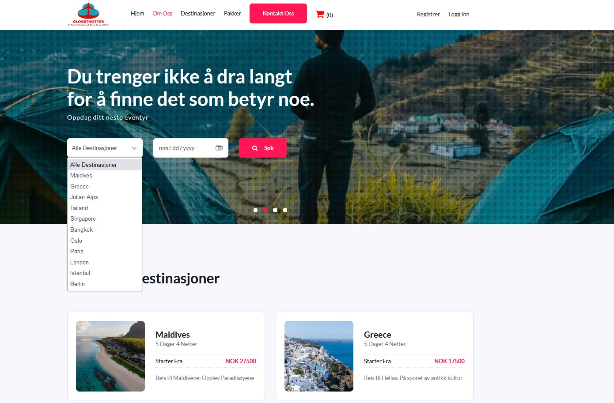
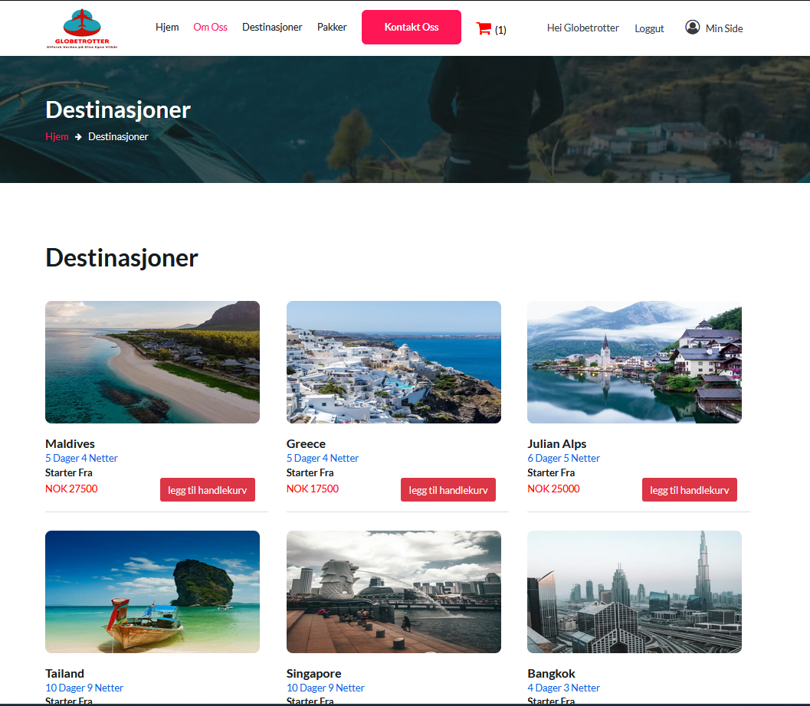
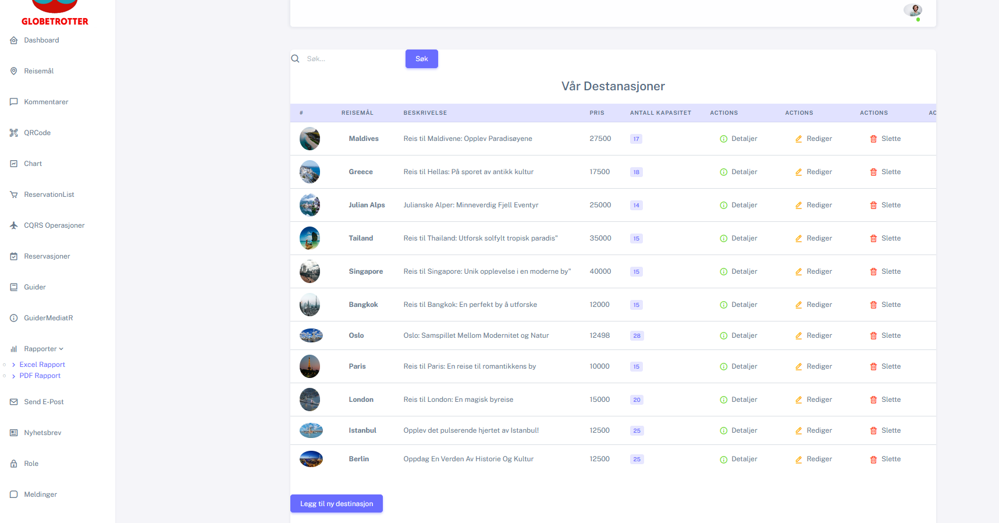
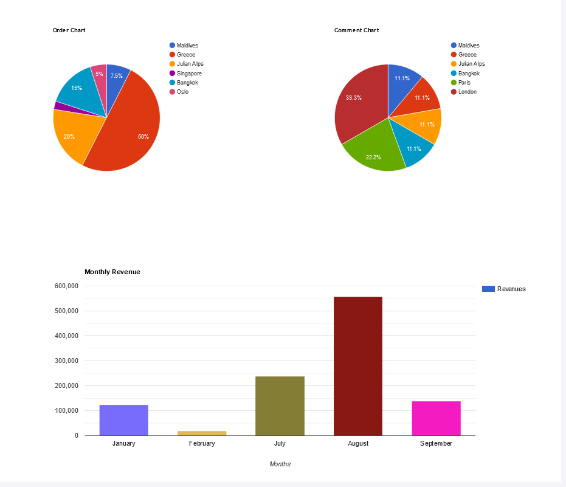

# Globetrotter

# Realestate Project

This project is a web application developed in .NET, utilizing various technologies such as SignalR, Google Charts, AJAX, MySQL, and Stripe payment integration.
# Vacation Planning Website

This project is a vacation planning website that allows users to create, manage, and share vacation plans. It is built using .NET Core, ASP.NET Core MVC, and MySQL for database operations.

## Technologies Used

This project utilizes the following technologies:

- .NET Core: The project is built on the .NET Core framework.
- ASP.NET Core MVC: It is used to create the web-based vacation planning platform.
- MySQL: The application uses MySQL as its database system.

## Features

- **User Authentication:** Users can create accounts, log in, and manage their profiles.
- **Vacation Plans:** Users can create, edit, and share vacation plans.
- **Plan Search:** Visitors can search for vacation plans using various filters.
- **Plan Details:** Detailed plan information includes content and contact details.
- **Plan Sharing:** Users can share vacation plans via social media or email.
- **Role-Based Access Control:** Different user roles may have different permissions and access levels.
- **Responsive Design:** The platform is designed to work on both desktop and mobile devices.
- Developed using .NET Framework and .NET 7.0.
- Utilized MySQL for data storage and management.
- Implemented SignalR for real-time web communication and updates.
- Utilized AJAX for seamless, asynchronous data retrieval and interaction.
- Integrated Google Charts for data visualization and reporting.
- Integrated Stripe for secure payment processing.
- Implemented user authentication and role-based access control mechanisms.
- Designed and implemented an admin dashboard for efficient management of application data.
- Employed N-Tier architecture for a modular and scalable design.
- Conducted API testing and documentation using tools like Postman and Swagger.
- Conducted comprehensive testing, including unit testing to ensure application reliability.
- Implemented security measures, including protection against Cross-Site Request Forgery (CSRF) attacks with Anti-Forgery tokens.
- Utilized localizationOptions settings to enhance the user experience and provide multilingual support.
- Implemented DTO (Data Transfer Object) and Mapping Functionality for efficient data manipulation.
- Integrated QR code generation for user-friendly experiences and interactions.

## Installation

To set up this project locally, follow these steps:

1. Clone the project: `git clone https://github.com/yourusername/vacationplanning.git](https://github.com/yunusy78/Globetrotter.git)`
2. Navigate to the project folder: `cd vacationplanning`
3. Restore project dependencies: `dotnet restore`
4. Configure the database connection in the `appsettings.json` file.
5. Run database migrations using Entity Framework Core CLI or tools like Visual Studio.
6. Start the application: `dotnet run`
7. Open your web browser and visit http://localhost:5000.

## Usage

- Registration: Users can create accounts and manage their profiles.
- Vacation Plan Creation: Users can create and edit vacation plans.
- Plan Search: Visitors can search for vacation plans using various filters.
- Plan Details: Detailed vacation plan information includes content and contact details.
- Plan Sharing: Users can share vacation plans via social media or email.
- Responsive Design: The platform is designed to work on both desktop and mobile devices.

## Database Configuration

This project uses MySQL as its database system.
You can configure the database connection in the `appsettings.json` file.

## License

This project is licensed under the [License Type] license. See the License File for more details.

## Project Resources

The project is available on GitHub for reference and collaboration: [GitHub Project Page](https://github.com/yunusy78/Globetrotter.git)

# Images

